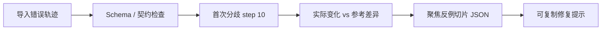
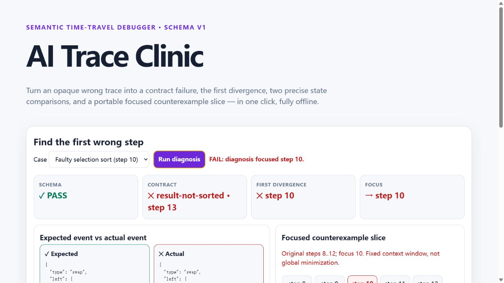

# FrontierLab

**把 AI 或算法生成的错误轨迹，收敛成可定位、可复现、可修复的证据。**

[](https://github.com/shop1111/FrontierLab/actions/workflows/ci.yml)
[](https://mooncakes.io/docs/shop1111/frontierlab)

[Open AI Trace Clinic](https://shop1111.github.io/FrontierLab/playground.html) ·
[GitHub](https://github.com/shop1111/FrontierLab) ·
[Gitlink](https://gitlink.org.cn/zhengpx/FrontierLab) ·
[Schema v1](docs/TRACE_SCHEMA.md)

> 当前正式版本是 **v0.7.0**，发布于 GitHub 与 Mooncakes；GitHub Pages
> 提供同版本的离线 AI Trace Clinic。Gitlink 镜像单独维护，不由此状态推断。

## 三条命令体验完整闭环

```bash
# 1. 对冻结的正确/错误轨迹执行契约、首次分歧与反例切片
moon run cmd/main -- diagnose fixtures/agent-traces/selection-sort-expected.json fixtures/agent-traces/selection-sort-actual.json --contract sorted-int-sequence --object values --format text --counterexample _build/counterexample.json --report _build/diagnosis.html

# 2. 生成完全离线、单文件的 AI Trace Clinic
moon run cmd/main -- playground --output _build/playground.html

# 3. 独立消费者只从 Mooncakes v0.6.0 解析依赖并复现实例
cd consumer/frontierlab_consumer_demo && moon test --target all --deny-warn
```

第一条命令预期返回退出码 `2`，自动定位到 **step 10**：正确轨迹交换
`item-2/item-4`（值 4 与 3），错误轨迹却使用过期下标交换
`item-2/item-0`（值 4 与 5）。这是有效输入上的语义失败，不是 CLI 错误。



## 产品闭环

FrontierLab 不是算法合集，也不是通用绘图库。算法或 Agent 记录
`Compare`、`Swap`、`Visit`、`Union`、`Relax` 等语义事件和完整场景快照；
同一份 schema-v1 轨迹随后可被：

- 契约检查，区分“格式正确”和“过程正确”；
- 与参考轨迹比较，定位第一次事件或状态分歧；
- 按稳定实体 ID 展示字段变化，而不是只比较数组下标；
- 切成前后各两步的便携聚焦反例切片，并生成离线 HTML 与修复提示；
- 通过 JSON CLI 接入 Agent/CI，或在浏览器本地一键诊断。

`diagnose` 的退出语义固定为：

- `0`：轨迹一致且契约通过；
- `2`：输入有效，但存在契约失败或首次分歧；
- `1`：参数、文件、JSON 或 Schema 错误。

旧有 `verify`、`diverge`、`diff`、`breakpoints`、`render` 等命令和
`frontierlab-debug-report/1.0` 外层报告保持兼容。

## 三种集成路径

1. **MoonBit 库**：用 `TraceBuilder` 记录过程，再优先调用
   `diagnose_trace`；需要自定义时再组合 contract、debugger 与 renderer。
2. **CLI / AI Agent**：使用稳定 JSON 报告与退出码，在流水线中直接运行
   `diagnose`。
3. **离线浏览器**：生成 `playground.html`，无需服务器、CDN、框架或联网；
   默认错误案例一次点击即跳到 step 10。

完整示例见 [集成说明](docs/INTEGRATION.md)、[Schema 说明](docs/TRACE_SCHEMA.md)
和[独立消费者证明](consumer/frontierlab_consumer_demo/README.md)。

## 核心 API

- 统一诊断：`diagnose_trace`、`TraceDiagnosis::passed`
- 构建：`TraceBuilder::new`、`record`、`finish`
- 模型：`AlgorithmTrace`、`TraceEvent`、`Scene`、`TargetRef`
- 调试：`diff`、`breakpoint_hits`、`slice`、`first_divergence`
- 契约：`sequence_transition_contract`、`sorted_int_sequence_contract`、
  `insertion_sort_int_contract`、`grid_path_contract`
- 协议：`encode_json`、`decode_json`、`validate`
- 输出：`render_trace_html`、`render_trace_svg`、`render_trace_playground`
- 兼容算法：BFS、Dijkstra、A*、插入排序、Union-Find

`AlgorithmTrace::decode_json` 接受可选 `TraceOptions`，因此大规模但明确授权
的 50,000 步基准可以突破默认 10,000 步安全上限，同时普通调用保持原行为。



## 从源码、可执行文件与发布包运行

当前候选最直接的查看方式是本地打开已生成页面：

```powershell
Set-Location D:\Code\Moonbit\frontierlab
Start-Process .\docs\playground.html
```

从源码运行 CLI 使用本页前三条命令。若希望得到可直接调用的本机程序：

```powershell
python scripts\build_cli.py
.\_dist\frontierlab.exe --version
```

脚本会在已忽略的 `_dist/` 中生成 `frontierlab.exe` 和 SHA256，不会把二进制
加入 Mooncakes 包或源码提交。GitHub v0.7.0 Release 同时提供已校验的 Windows
可执行文件、SHA256、Mooncakes 源码包和冻结诊断证据。

## 开发与验收

```bash
moon check --target all --deny-warn
moon build --target all --deny-warn
moon fmt --check
moon info
moon test --target all --deny-warn
python scripts/check_coverage.py
node scripts/check_playground.mjs
python scripts/validate_cli.py
moon package --list
moon package
```

覆盖率门禁要求统一诊断、调试器、契约、codec、report、quality 和 CLI 调度
零未覆盖，且扣除带理由的真正入口、benchmark、示例入口后，全仓不超过 10 行。规则记录在
[`coverage-exemptions.json`](coverage-exemptions.json)。

## Documentation

- [三分钟演示脚本](DEMO_SCRIPT.md)
- [评委逐步验收](ACCEPTANCE.md)
- [Trace Schema v1](docs/TRACE_SCHEMA.md)
- [三种集成路径](docs/INTEGRATION.md)
- [渲染与安全模型](docs/RENDERING.md)
- [可复现性能记录](BENCHMARKS.md)
- [发布与逐平台核验](RELEASE_GUIDE.md)
- [变更记录](CHANGELOG.md)

## License

MIT
