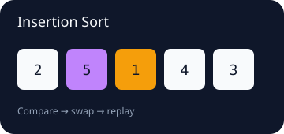
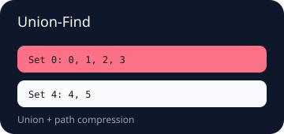
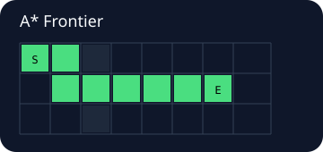

# FrontierLab

**A MoonBit Algorithm Trace & Visualization Kit — record why an algorithm changes, then replay what changed.**

[中文](#中文) · [English](#english) · [Live demo](https://shop1111.github.io/FrontierLab/) · [Trace schema](docs/TRACE_SCHEMA.md) · [Integration guide](docs/INTEGRATION.md)

| Insertion sort | Union-Find | A* frontier |
|---|---|---|
|  |  |  |

## 中文

FrontierLab 不是另一个算法合集，也不是通用绘图库。它为 MoonBit 算法提供统一的**语义事件 + 场景快照**协议：算法记录 `Compare`、`Swap`、`Visit`、`Union`、`Relax` 等事件，同时提交这一刻的序列、集合、图或网格状态；渲染器再把记录导出为可离线播放的 HTML、确定性 SVG 或 JSON。

### 为什么值得用

- 任意步骤随机跳转，不需要从头重放事件。
- 事件保留“为什么变化”，场景保留“应该画什么”。
- 生成的 HTML 不依赖 CDN、Node.js、服务器或浏览器插件。
- 稳定实体 ID 让元素在交换、合并和寻路过程中仍可追踪。
- 原有 BFS、Dijkstra、A*、ASCII/SVG API 完整保留。

### 五分钟体验

```bash
moon check --target all
moon test

# 生成可交互的单文件 HTML
moon run cmd/main -- demo insertion-sort --format html --output insertion-sort.html
moon run cmd/main -- demo union-find --format html --output union-find.html
moon run cmd/main -- demo pathfinding --format html --output pathfinding.html

# 也可以输出 SVG 或 JSON；使用 - 输出到标准输出
moon run cmd/main -- demo pathfinding --format svg --output pathfinding.svg
moon run cmd/main -- demo insertion-sort --format json --output trace.json
moon run cmd/main -- validate trace.json
moon run cmd/main -- render trace.json --format html --output replay.html
```

浏览器直接打开生成的 HTML，即可使用播放、暂停、时间轴、速度控制以及左右方向键。

### 把任意算法接入可视化

```mbt check
test {
  let initial = @frontierlab.Scene::new(objects=[
    @frontierlab.Sequence(@frontierlab.SequenceState::new(
      id="values",
      label="My algorithm",
      items=[
        @frontierlab.SequenceItem::new(id="a", value="3"),
        @frontierlab.SequenceItem::new(id="b", value="1"),
      ],
    )),
  ])
  let recorder = @frontierlab.TraceBuilder::new(
    title="Tiny trace",
    algorithm="my-algorithm",
    initial_scene=initial,
  )
  recorder.record(
    event=@frontierlab.Compare([
      @frontierlab.TargetRef::entity("values", "a"),
      @frontierlab.TargetRef::entity("values", "b"),
    ]),
    scene=initial,
    annotation=@frontierlab.Annotation::new(
      title="Compare",
      body="Compare the two stable entity ids.",
    ),
  )
  let html = @frontierlab.render_trace_html(recorder.finish())
  assert_true(html.contains("Tiny trace"))
}
```

完整接入方式见 [docs/INTEGRATION.md](docs/INTEGRATION.md)。

### 内置能力

- `AlgorithmTrace` / `AlgorithmTraceStep`：版本化 trace 文档与不可变步骤快照。
- `TargetRef`：使用对象 ID + 可选实体 ID，消除跨对象同名实体歧义。
- `encode_json` / `decode_json` / `validate`：稳定 schema-v1 双向协议与完整验证。
- `TraceEvent`：初始化、比较、交换、访问、更新、合并、松弛、完成及自定义事件。
- `SceneObject`：`Sequence`、`Sets`、`Graph`、`Grid`。
- `Highlight` / `Annotation`：统一视觉角色、教学说明和伪代码行号。
- `render_trace_html`：自包含、响应式、支持深浅主题的交互播放器。
- `render_trace_svg` / `render_trace_svg_frames`：单帧与批量确定性 SVG。
- `search_trace_to_algorithm_trace`：原有路径搜索 trace 的兼容适配器。

### 旗舰示例

```bash
moon run examples/insertion_sort > insertion-sort.html
moon run examples/union_find > union-find.html
moon run examples/pathfinding_trace > pathfinding.html

# 原有教学示例仍可运行
moon run examples/maze_bfs
moon run examples/weighted_astar
moon run examples/compare
```

### 与相邻项目的区别

- 绘图库解决“如何画”；FrontierLab 定义“算法过程如何记录和解释”。
- 图算法库解决“如何计算”；FrontierLab 不要求算法属于图领域。
- 性能 tracing 记录耗时和调用区间；FrontierLab 记录 compare、swap、union、relax 等教学语义。
- 可视化页面只是消费者；`AlgorithmTrace` JSON 可继续接入课程、IDE、评测平台或视频生成工具。

## English

FrontierLab records algorithm semantics and complete visual scenes in MoonBit. An algorithm emits events such as `Compare`, `Swap`, `Union`, or `Relax` and snapshots a sequence, set, graph, or grid. The same trace can then become an offline interactive HTML player, deterministic SVG frames, or portable JSON.

The original pathfinding APIs remain compatible. BFS, Dijkstra, and A* now serve as a flagship adapter alongside insertion sort and Union-Find.

### Public API map

- Build: `TraceBuilder::new`, `record`, `finish`
- Model: `AlgorithmTrace`, `TraceEvent`, `Scene`, `SceneObject`
- Visual state: `SequenceState`, `SetState`, `GraphState`, `GridState`
- Explain: `Highlight`, `HighlightRole`, `Annotation`
- Export: `render_trace_html`, `render_trace_svg`, `render_trace_svg_frames`
- Adapt: `search_trace_to_algorithm_trace`

### Development and release readiness

```bash
moon check --target all
moon test
moon info
moon fmt
```

The repository includes CI, generated interfaces, executable examples, a Pages deployment workflow, schema fixtures, an MIT license, contribution guidance, and mooncakes publishing metadata.

## Documentation

- [Trace schema and compatibility](docs/TRACE_SCHEMA.md)
- [Integrating a third-party algorithm](docs/INTEGRATION.md)
- [Rendering and security model](docs/RENDERING.md)
- [Reproducible benchmarks](BENCHMARKS.md)
- [Contributing](CONTRIBUTING.md)
- [Changelog](CHANGELOG.md)

## License

MIT
